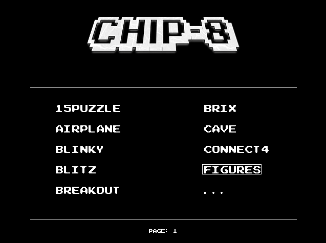

# Emulator for CHIP8

## How to use

You could run emulator in your terminal or use PyGame.

```
usage: chip8.py [-h] [-t {console,pygame}] [-f FILE] [-d | --debug | --no-debug]

CHIP-8 Emulator

options:
  -h, --help            show this help message and exit
  -t {console,pygame}, --type {console,pygame}
                        Type of emulator. By default: pygame.
  -f FILE, --file FILE  Path to ROM file.
  -d, --debug, --no-debug
```

or `$ python menu.py`



## Keyboard Map
```
+---+---+---+---+
| 1 | 2 | 3 | 4 |
| q | w | e | r |
| a | s | d | f |
| z | x | c | v |
+---+---+---+---+
```

## Info

https://en.wikipedia.org/wiki/CHIP-8

http://devernay.free.fr/hacks/chip8/C8TECH10.HTM
